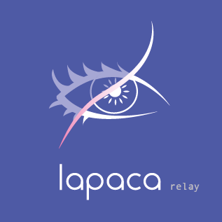

# lapaca
Reconstruct the content of a webhook on the fly!

# Run
lapaca has no persistence, you only have to setup an environment variable "hmacKey" with the key encoded in safe url base64 format (replacing the charaters "/" with "_" and "+" with "-").

You can use an online generator like [this one](https://generate.plus/en/base64)

## Vanilla Docker
```
docker run -d -p 80:80 -e hmacKey={YOUR_REALLY_RANDOM_KEY} ghcr.io/aitgelion/lapaca:main
```

## Using docker-compose
```
docker-compose up -d
```

Sample docker-compose:

```
version: '3.7'
services:
  lapaca:
    container_name: lapaca
    image: ghcr.io/aitgelion/lapaca:main
    environment:
      # WARNING: Change this key!!!
      hmacKey: "GuPrRON7FlSloWkUy1oDfQ=="
      enableOpenApi: "true"
    ports:
    - 80:80
```

# Operation:
- Create a new WebHook in the remote service and save the url
- Write the target JSON format, replacing values from the origin JSON
- Post the private {hmacKey}, the remote webhook url and the target JSON to 'localhost:80/api/wh'
- Get the returned URL and setup to the source WebHook generator.

# TODO: Example [harbor](https://goharbor.io/docs/2.2.0/working-with-projects/project-configuration/configure-webhooks/) events to [Microsoft Teams](https://docs.microsoft.com/es-es/microsoftteams/platform/webhooks-and-connectors/how-to/connectors-using?tabs=cURL#send-adaptive-cards-using-an-incoming-webhook)
